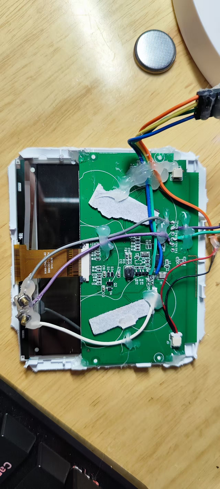
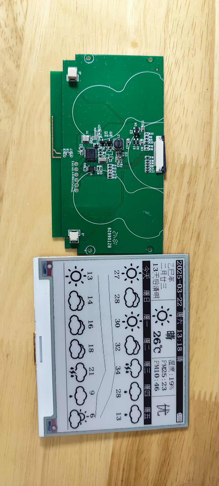
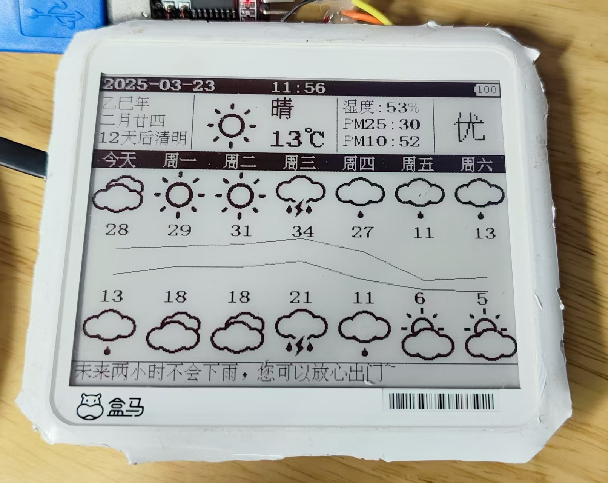
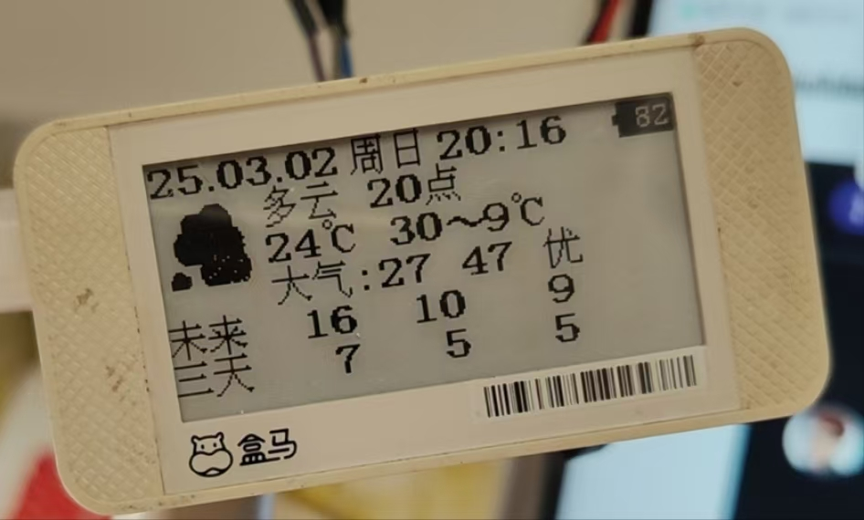

# HMB_DISPLAYER
# 基于盒马2.3寸、4.2寸墨水屏DIY

可通过OpenMqttGateway接入homeassistant，使用node-red实现各种智能化功能：
1. 时间、天气定时同步，显示自定义内容，每5分钟切换未来7天天气和本月日历；
2. 可引出按键实现智能设备联动，例如控制插座、切换场景等；
3. 内置3000个常用字字库，可实现电子书功能；

# 目前进度：
* 时间、天气定时同步；✔
* 显示未来7天天气和本月日历，5分钟自动切换；✔
* 未来7天天气可通过修改node-red返回显示自定义内容，默认显示天气预警，若无预警则显示下雨预测；✔
* 番茄时钟；
* 时尚版日历显示；
* 黑白红照片显示；
* 电子书功能，需改造pcb焊接TF卡座；
* 单按键控制逻辑：支持界面切换、电子书翻页、进入设置菜单、菜单切换、修改设置等；

# 视频

<video width="800" height="400" controls>
  <source src="./PIC/复位和天气同步.mp4" type="video/mp4">
  您的浏览器不支持 video 标签。
</video>

# 硬件
- 墨水屏：盒马2.3寸、4.2寸
- 微控制器：DA14585（盒马自带）
- 按键：单按键（需自行引出）
- 存储：内置3000个常用字字库，需改造pcb焊接TF卡座以实现电子书功能
- 连接：使用蓝牙通过OpenMqttGateway接入homeassistant

## 开发环境

## 原版PCB+墨水屏

## 天气+未来七天

## 2.3寸旧界面

